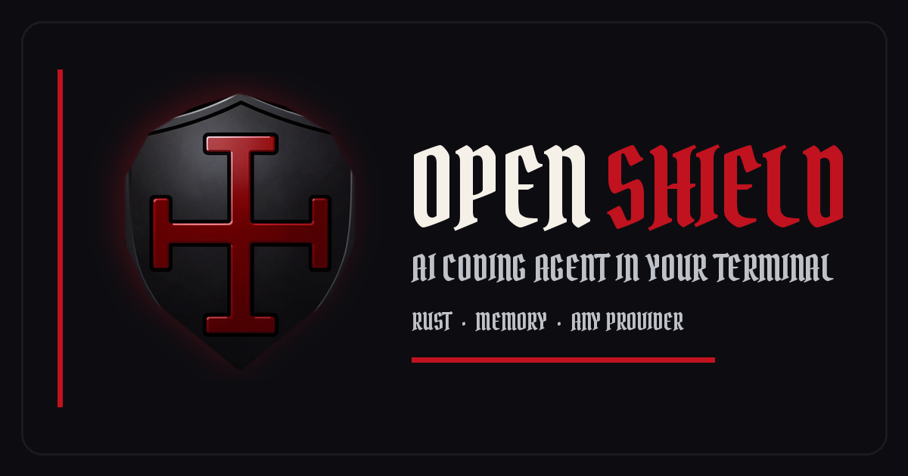

# OpenShield

AI coding agent in your terminal. Rust. Open source. Blackshield by default.



[](https://github.com/synthalorian/openshield)
[](LICENSE)
[](https://rust-lang.org)

## What It Does

- **Persistent memory** — SQLite-backed sessions with keyword and semantic search. Close the terminal, come back next week, it still knows what you were doing.
- **Any model provider** — Works with any OpenAI-compatible API. OpenRouter, llama-swap, xAI, local servers. Not locked to anyone.
- **Autonomous agent mode** — Plans, executes, verifies, retries. You approve the plan, it does the work.
- **Blackshield TUI** — Blood, steel, bone, and void palette with the Blackshield Mercenary shield on launch.

## Install

```bash
curl -sSL https://raw.githubusercontent.com/synthalorian/openshield/main/install.sh | bash
```

Requires Rust (installs via rustup if missing). Binary goes to `~/.local/bin/openshield`.

## First Run

```bash
openshield setup    # Configure providers and models
openshield          # Start TUI session
```

Set one API key environment variable before starting: `OPENAI_API_KEY`, `ANTHROPIC_API_KEY`, `KIMI_API_KEY`, or `XAI_API_KEY`.

## Commands

| Command | Description |
|---------|-------------|
| `openshield` | Start TUI session |
| `openshield setup` | Configure providers, models, preferences |
| `openshield agent "<task>"` | Execute task autonomously |
| `openshield chat "<message>"` | One-shot chat |
| `openshield memory <query>` | Search persistent memory |
| `openshield memory <query> --semantic` | Semantic memory search |
| `openshield stats` | Token usage and model performance |
| `openshield models` | List available models |
| `openshield config` | Show configuration |

## TUI Keybindings

| Key | Action |
|-----|--------|
| `Ctrl+A` | Toggle autonomous mode |
| `Ctrl+T` | Cycle themes |
| `/multi` | Toggle multi-model mode |
| `/compare` | Show multi-model comparison |
| `↑/↓` | Navigate history |

Themes: `blackshield` (default), `steel_blue`, `high_contrast`.

## Tools

9 built-in tools: `edit`, `fs`, `git`, `lsp`, `refactor`, `search`, `grep`, `terminal`, `test`. Plus MCP server tools via native client.

## Config

Config lives at `~/.config/openshield/config.toml`. Run `openshield setup` for interactive generation.

<details>
<summary>Example config</summary>

```toml
version = "1.1.0"
default_model = "gpt-4o"
auto_route = true
cost_limit_usd = 10.0
theme = "blackshield"

[providers.openai]
base_url = "https://api.openai.com/v1"
api_key = "${OPENAI_API_KEY}"

[[providers.openai.models]]
name = "gpt-4o"
context_length = 128000
cost_per_1k_input = 0.005
cost_per_1k_output = 0.015
capabilities = ["code", "chat", "analysis"]
```

</details>

## Development

```bash
git clone https://github.com/synthalorian/openshield
cd openshield
cargo build --release
cargo test
```

## More

- [CHANGELOG.md](CHANGELOG.md) — Version history
- [ROADMAP.md](ROADMAP.md) — Future plans
- [STATUS.md](STATUS.md) — Current development status

## License

MIT

---

## ☕ Support the Developer

If this project saved you time, solved a problem, or kept your terminal a little more steel-forged, you can fuel the next one:

[](https://buymeacoffee.com/synthalorian)
