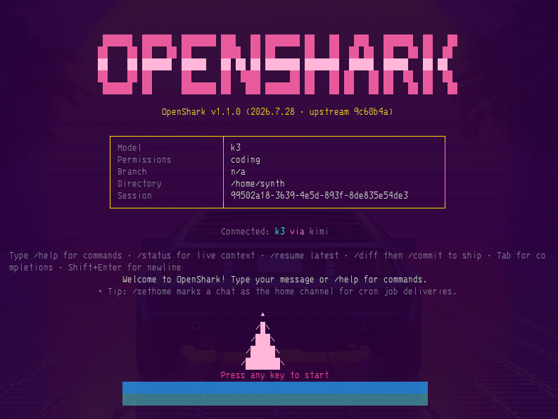

# OpenShark

AI coding agent in your terminal. Rust. Open source.




[](https://github.com/synthalorian/openshark)
[](LICENSE)
[](https://rust-lang.org)

## What It Does

- **Persistent memory** — SQLite-backed sessions with keyword and semantic search. Close the terminal, come back next week, it still knows what you were doing.
- **Any model provider** — Works with any OpenAI-compatible API. OpenRouter, llama-swap, xAI, local servers. Not locked to anyone.
- **Autonomous agent mode** — Plans, executes, verifies, retries. You approve the plan, it does the work.

Also: smart model routing, self-improvement analytics, Discord/Telegram bots, MCP client, 3 TUI themes, 4-layer security.

## Install

```bash
curl -sSL https://raw.githubusercontent.com/synthalorian/openshark/main/install.sh | bash
```

Requires Rust (installs via rustup if missing). Binary goes to `~/.local/bin/openshark`.

## First Run

```bash
openshark setup    # Configure providers and models
openshark          # Start TUI session
```

Set one API key environment variable before starting: `OPENAI_API_KEY`, `ANTHROPIC_API_KEY`, `KIMI_API_KEY`, or `XAI_API_KEY`.

## Commands

| Command | Description |
|---------|-------------|
| `openshark` | Start TUI session |
| `openshark setup` | Configure providers, models, preferences |
| `openshark agent "<task>"` | Execute task autonomously |
| `openshark chat "<message>"` | One-shot chat |
| `openshark memory <query>` | Search persistent memory |
| `openshark memory <query> --semantic` | Semantic memory search |
| `openshark stats` | Token usage and model performance |
| `openshark models` | List available models |
| `openshark config` | Show configuration |

## TUI Keybindings

| Key | Action |
|-----|--------|
| `Ctrl+A` | Toggle autonomous mode |
| `Ctrl+T` | Cycle themes |
| `/multi` | Toggle multi-model mode |
| `/compare` | Show multi-model comparison |
| `↑/↓` | Navigate history |

## Tools

9 built-in tools: `edit`, `fs`, `git`, `lsp`, `refactor`, `search`, `grep`, `terminal`, `test`. Plus MCP server tools via native client.

## Config

Config lives at `~/.config/openshark/config.toml`. Run `openshark setup` for interactive generation.

<details>
<summary>Example config</summary>

```toml
version = "1.1.0"
default_model = "gpt-4o"
auto_route = true
cost_limit_usd = 10.0

[providers.openai]
base_url = "https://api.openai.com/v1"
api_key = "${OPENAI_API_KEY}"

[[providers.openai.models]]
name = "gpt-4o"
context_length = 128000
cost_per_1k_input = 0.005
cost_per_1k_output = 0.015
capabilities = ["code", "chat", "analysis"]
```

</details>

## Development

```bash
git clone https://github.com/synthalorian/openshark
cd openshark
cargo build --release
cargo test
```

## More

- [CHANGELOG.md](CHANGELOG.md) — Version history
- [ROADMAP.md](ROADMAP.md) — Future plans
- [STATUS.md](STATUS.md) — Current development status

## License

MIT
